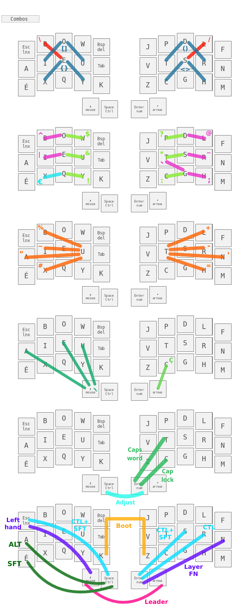

### Custom aurora sweep keymap

This keymap is inspired by [optimot](https://optimot.fr) which is a French layout.\
Nonetheless it uses the US international extended keymap for French keys.

It uses the _best_ qmk features :

- combos ♥
- auto shift
- leader

I tried to optimise key positions for neovim and i3wm while limit digrams.\
The oled screens are used to display the current layout, the modifier keys and the leader key.

#### Install

Clone this repo in the folder :

    ~/qmk_firmware/keyboards/splitkb/aurora/sweep/keymaps/

#### Compile and flash

Navigate into the keymap folder and launch this command for both sides :

    qmk compile && qmk flash

and :

    Click twice on the flash button and use nautilus for instance to clic on the keyboard.
    Don't forget to flash with the double tap bootloader define before soldering.

#### Layout

Set the us altgr international to activate French keys :

    /usr/share/X11/xkb/symbols/
    localectl list-x11-keymap-variants us

    setxkbmap us altgr-intl

#### Links

[qmk](https://docs.qmk.fm/#/)\
[ferris sweep](https://github.com/davidphilipbarr/Sweep)\
[splitkb](https://splitkb.com)

#### Layouts

\
\
\
\
\

#### Leader

| ------------------ | -------- | ------------------ | -------- | ------------------ | -------- |
| :----------------: | :------- | :----------------: | :------- | :----------------: | :------- |
|     C + O + P      | ©        |     M + U + L      | ×        |     L + O + V      | ♥        |
|     R + E + G      | ®        |     D + I + V      | ÷        |     F + L + A      | ⚡       |
|     D + I + A      | ø        |       P + M        | ±        |     S + T + A      | ✶        |
|     D + E + G      | °        |     I + N + E      | ≠        |     B + U + L      | 💡       |
|     S + E + C      | §        |     A + L + M      | ≈        |     I + N + F      | ℹ️        |
|     P + O + U      | £        |     S + Q + U      | √        |     G + E + A      | ⚙️        |
|     Y + E + N      | ¥        |     I + N + F      | ∞        |         V          | ✓        |
|     C + E + N      | ¢        |       < + <        | ≤        |       V + B        | ✔        |
|     B + E + T      | ß        |       > + >        | ≥        |       V + V        | ✅       |
|     M + I + C      | µ        |     F + C + T      | ¼        |         X          | ✗        |
|       P + I        | π        |     F + C + G      | ½        |       X + B        | ✘        |
|     O + M + E      | Ω        |     F + H + T      | ¾        |         ?          | ❔       |
|     U + P + F      | ⁰        |                    |          |       ? + ?        | ❓       |
|     D + N + F      | ₀        |                    |          |         !          | ❕       |
|                    |          |                    |          |       ! + !        | ❗       |
