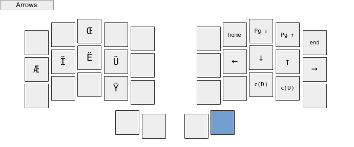
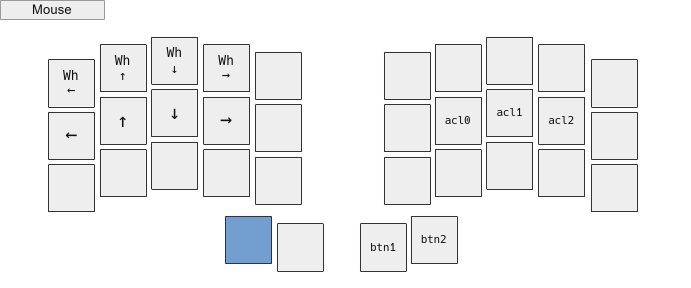
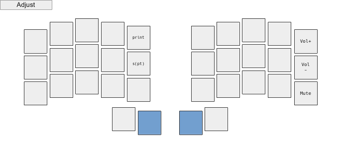

### Custom aurora sweep keymap

This keymap is inspired by [optimot](https://optimot.fr) which is a French layout.\
Nonetheless it uses the US international extended keymap for French keys.

It uses the _best_ qmk features :

- combos ♥
- auto shift
- leader

I tried to optimise key positions for neovim and i3wm while limit digrams.\
The oled screens are used to display the current layout, the modifier keys and the leader key.

#### Install

Clone this repo in the folder :

    ~/qmk_firmware/keyboards/splitkb/aurora/sweep/keymaps/

#### Compile and flash

Navigate into the keymap folder and launch this command for both sides :

    qmk compile && qmk flash

and :

    Click twice on the flash button and use nautilus for instance to clic on the keyboard.
    Don't forget to flash with the double tap bootloader define before soldering.

#### Layout

Set the us altgr international to activate French keys :

    /usr/share/X11/xkb/symbols/
    localectl list-x11-keymap-variants us

    setxkbmap us altgr-intl

#### Links

[qmk](https://docs.qmk.fm/#/)\
[ferris sweep](https://github.com/davidphilipbarr/Sweep)\
[splitkb](https://splitkb.com)

#### Layouts

\
\
\
\
\

#### Leader

| -         |   |
| --------- | - |
| C + O + P | © |
| R + E + G | ® |
| D + I + A | ø |
| D + E + G | ° |
| S + E + C | § |
| P + O + U | £ |
| Y + E + N | ¥ |
| C + E + N | ¢ |
| B + E + T | ß |
| M + I + C | µ |
| P + I     | π |
| O + M + E | Ω |
| U + P + F | ⁰ |
| D + N + F | ₀ |

| -         |   |
| --------- | - |
| M + U + L | × |
| D + I + V | ÷ |
| P + M     | ± |
| I + N + E | ≠ |
| A + L + M | ≈ |
| S + Q + U | √ |
| I + N + F | ∞ |
| < + <     | ≤ |
| > + >     | ≥ |
| F + C + T | ¼ |
| F + C + G | ½ |
| F + H + T | ¾ |

| -         |    |
| --------- | -- |
| L + O + V | ♥  |
| F + L + A | ⚡ |
| S + T + A | ✶  |
| B + U + L | 💡 |
| I + N + F | ℹ️  |
| G + E + A | ⚙️  |
| V         | ✓  |
| V + B     | ✔  |
| V + V     | ✅ |
| X         | ✗  |
| X + B     | ✘  |
| ?         | ❔ |
| ? + ?     | ❓ |
| !         | ❕ |
| ! + !     | ❗ |
