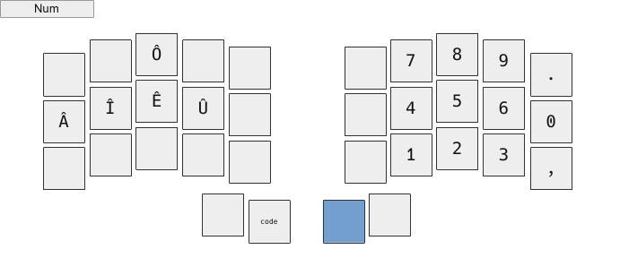

### Custom aurora sweep keymap

This keymap is inspired by [optimot](https://bepo.fr/) which is a French layout.  
Nonetheless it uses the US international extended keymap for French keys.  

It uses the *best* qmk features :
- combos ♥
- auto shift
- leader

I tried to optimise key positions for neovim and i3wm while limit digrams.  
The oled screens are used to display the current layout, the modifier keys and the leader key.  

#### Install

Clone this repo in the folder :

    ~/qmk_firmware/keyboards/splitkb/aurora/sweep/keymaps/

#### Compile and flash

Navigate into the keymap folder and launch this command for both sides :

    qmk compile && qmk flash

and :

    Click twice on the flash button and use nautilus for instance to clic on the keyboard.  
    Don't forget to flash with the double tap bootloader define before soldering.

#### Layout

Set the us international to activate French keys :

    /usr/share/X11/xkb/symbols/
    localectl list-x11-keymap-variants us

    setxkbmap us altgr-intl

#### Links

[qmk](https://docs.qmk.fm/#/)  
[ferris sweep](https://github.com/davidphilipbarr/Sweep)  
[splitkb](https://splitkb.com)  

#### Layouts

  
  
  
  
  
  
  
  
  
  
  

#### Leader

| -                  |                        |
|--------------------|------------------------|
|   M + S            |   mail short           |
|   M + L            |   mail long            |
|   D + E + G        |   °                    |
|   C + O + P        |   ©                    |
|   R + E + G        |   ®                    |
|   D + I + A        |   ø                    |
|   D + I + A + M    |   Ø                    |
|   E + U + R        |   €                    |
|   P + O + U        |   £                    |
|   Y + E + N        |   ¥                    |
|   C + E + N        |   ¢                    |
|   P + I            |   π                    |
|   P + I + I        |   Π                    |
|   O + M + E        |   ω                    |
|   O + M + E + G    |   Ω                    |
|   U + P + F        |   ⁰                    |
|   D + N + F        |   ₀                    |

| -                  |                        |
|--------------------|------------------------|
|   M + U + L        |   ×                    |
|   D + I + V        |   ÷                    |
|   P + M            |   ±                    |
|   I + N + E        |   ≠                    |
|   A + L + M        |   ≈                    |
|   S + Q + U        |   √                    |
|   I + N + F        |   ∞                    |
|   < + <            |   ≤                    |
|   > + >            |   ≥                    |
|   F + S + T        |   ¼                    |
|   F + S + G        |   ½                    |
|   F + H + T        |   ¾                    |

| -                  |                        |
|--------------------|------------------------|
|   F + L + A        |   ⚡                   |
|   S + P + A        |   ✨                   |
|   O + W + D        |   ⛔                   |
|   C + O + F        |   ☕                   |
|   U + M + B        |   ☔                   |
|   Y + E + S        |   ✅                   |
|   N + O            |   ❎                   |
|   C + R + O        |   ❌                   |
|   ?                |   ❔                   |
|   !                |   ❕                   |
|   ? + ?            |   ❓                   |
|   ! + !            |   ❗                   |
